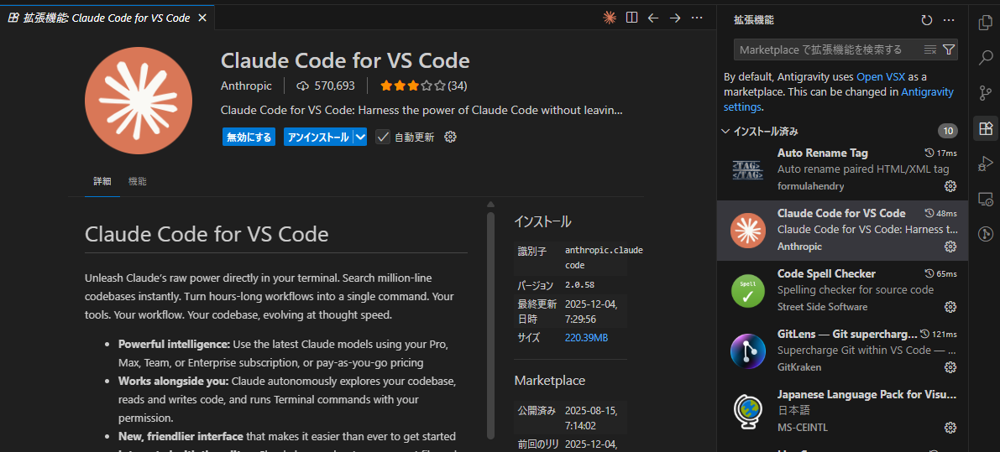
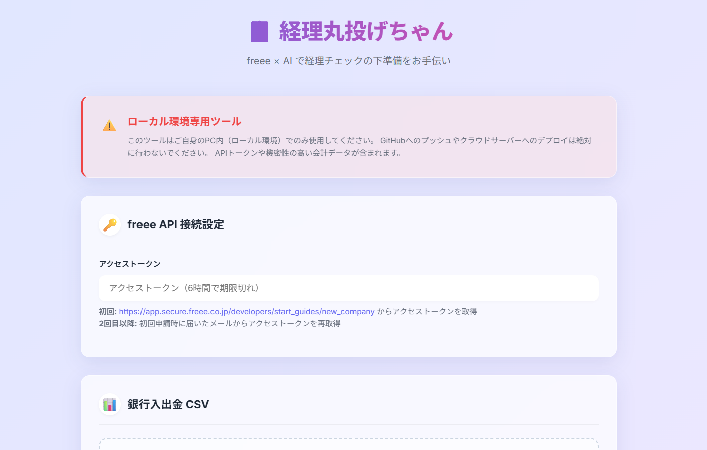

<div align="center">

# 🧾 バーチャル税務調査<br>～経理丸投げちゃん～

**freee会計 × AI で、経理チェックの下準備を自動化**

[](LICENSE)
[](https://www.python.org/)
[](https://developer.freee.co.jp/)
[](https://claude.ai/)

<br>

税務調査官がチェックする20項目を、**調査が来る前に自分で潰せる**ツール。<br>
「これ経費で落ちる？」を、あなたの実データを見ながらAIが判断してくれます。

<br>

[📖 使い方を見る](#クイックスタート) ・ [🌐 公式サイト](https://clanbiz.net/keiri-marunage-chan-LP/) ・ [📋 拡張ガイド](EXTENSION_GUIDE.md)

---

</div>

> **対象ユーザー**
>
> このツールは以下の環境をお持ちの方を想定しています：
> - **freee会計**の有料プラン（APIアクセスが必要）
> - **Claude Code**（Anthropic）← 推奨
>
> ※ Gemini CLI や GitHub Copilot でも動作しますが、処理が途中で止まることがあるため Claude Code を推奨します

> **セキュリティ**
>
> このツールは**ローカル環境専用**です。
> - データはPC内でのみ処理され、外部サーバーには送信されません
> - GitHubへのプッシュやクラウドデプロイは絶対に行わないでください
> - トークンはブラウザタブを閉じると消去されます

---

## クイックスタート

初めての方はここから。**4ステップ**で始められます。

### Step 1: AIエージェントを起動してプロンプトをコピペ

1. **VSCode** か **Antigravity** を開く
2. **Claude Code**（推奨）を起動
3. AIエージェントに以下をコピペして伝える：

```
https://github.com/CLANBIZ/keiri-marunage-chan をクローンして、python server.py を実行して http://localhost:5000 をブラウザで開いて。うまく行かない場合 AI_GUIDE.md と FREEE_API_GUIDE.md と TROUBLESHOOTING.md を読んで解決策を探して
```

💡 **Claude Codeの起動方法**

**方法1**: ターミナルから `claude`（Windowsは `wsl claude`）

**方法2**: VSCode拡張機能「Claude Code」をインストール → 右上のオレンジ色の **Claude ボタン** をクリック



### Step 2: UIが開いたら以下を準備

| 準備するもの | 説明 |
|-------------|------|
| **freeeアクセストークン** | 下記 Step 3 参照 |
| **銀行入出金CSV** | ネットバンキングからダウンロードしたCSV |
| **法人資料** | 議事録、規程、契約書などをフォルダごとアップロード |



### Step 3: freeeアクセストークンを取得

- **初回**: [こちら](https://app.secure.freee.co.jp/developers/start_guides/new_company)から事業所登録してトークンを取得
- **2回目以降**: 初回登録時にfreeeから届いたメール内の「アクセストークン取得ページへ」をクリック


### Step 4: 経理チェック開始

資料のアップロードが完了したら、Claude Codeに以下を伝えてください：

```
AI_GUIDE.md と FREEE_API_GUIDE.md を読んで、ワークフローどおりに税務チェックして。うまく行かない場合 TROUBLESHOOTING.md を読んで解決策を探して
```

✨ **これでAIが自動的にfreeeのデータと資料を照合し、確認が必要な点をリストアップしてくれます。**

---

## このツールについて

中小企業や個人事業主の方が、日々の経理処理に不安を感じたとき、AIに相談しながらセルフチェックできる環境を提供します。

**このツールでできること：**
- freee会計の取引データを取得し、税区分や勘定科目の設定を確認
- アップロードした銀行CSVと照合して、入力漏れがないかチェック
- 気になる点をリストアップして、税理士への相談材料を整理

**このツールの位置づけ：**
- 税理士や専門家に相談する**前の下準備**を補助するものです
- AIの判断は参考情報であり、最終判断は必ず専門家にご確認ください
- freee会計の機能を補完するものであり、代替するものではありません

---

## 必要要件

- Python 3.8+
- freee会計アカウント

## セットアップ

```bash
# 1. クローン
git clone https://github.com/CLANBIZ/keiri-marunage-chan.git
cd keiri-marunage-chan

# 2. 依存ライブラリのインストール
pip install -r requirements.txt

# 3. サーバー起動
python server.py
```

ブラウザで http://localhost:5000 を開くとUIが表示されます。

---

## ドキュメント（ユーザー向け）

| ファイル | 内容 |
|---------|------|
| `PROMPTS.md` | **AIプロンプト集（コピペ用）** - 28種類のプロンプト |

## ドキュメント（AI向け）

| ファイル | 内容 |
|---------|------|
| `AI_GUIDE.md` | 運用ガイド・チェックリスト |
| `FREEE_API_GUIDE.md` | freee API連携ガイド |
| `CASE_STUDY.md` | よくある確認ポイント |
| `TROUBLESHOOTING.md` | トラブル対応集 |

## ドキュメント（開発者・税理士・自治体向け）

| ファイル | 内容 |
|---------|------|
| `EXTENSION_GUIDE.md` | 別の会計ソフト対応、独自税務ルール追加、多言語対応 |

---

## ライセンス

**MIT License** - Copyright (c) 2025 株式会社CLAN (https://clanbiz.net/keiri-marunage-chan-LP/)

### 免責事項

このソフトウェアは「現状のまま」提供されます。開発者は一切の責任を負いません。
税務に関する最終判断は必ず税理士等の専門家にご確認ください。

### フォーク時のお願い

改変・再配布する場合は、以下のクレジット表記を記載してください：

```
Original work: バーチャル税務調査～経理丸投げちゃん～
https://github.com/CLANBIZ/keiri-marunage-chan
Copyright (c) 2025 株式会社CLAN (https://clanbiz.net/keiri-marunage-chan-LP/)
```
